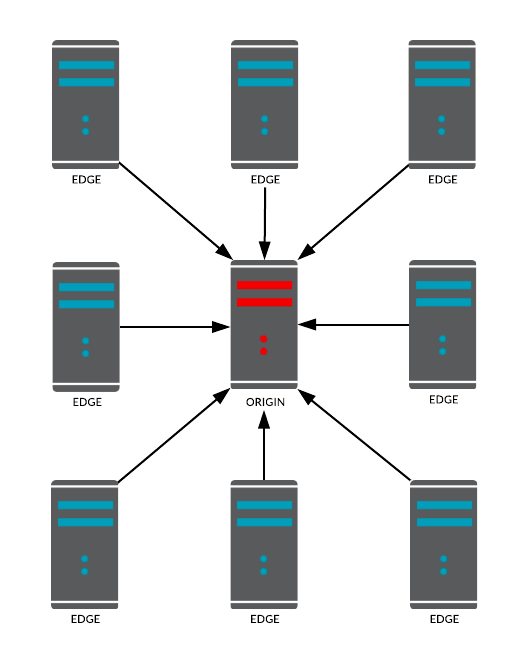
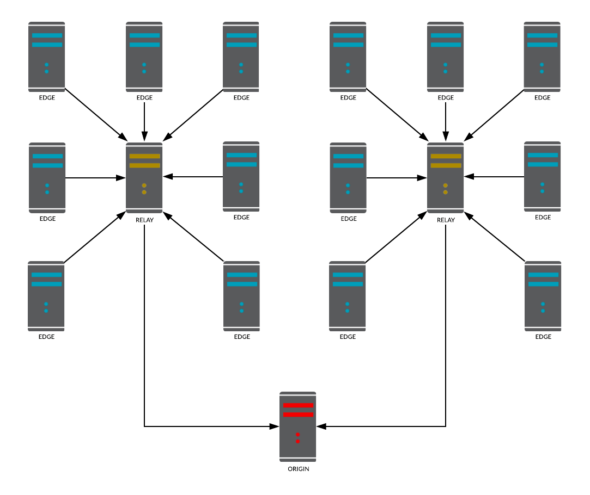
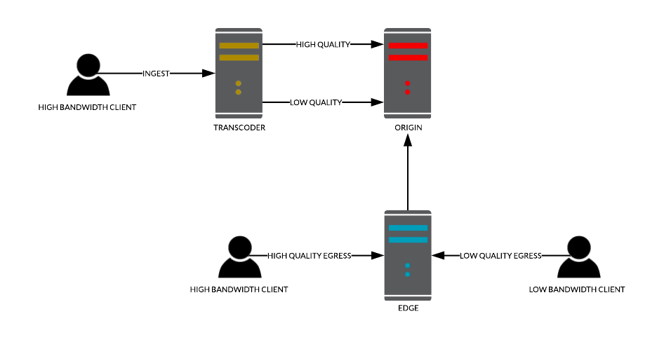

# Maximize Scaling with Relays & Transcoders

## Introduction

Autoscaling has always been the center of focus for cloud business that require dynamic scaling capabilities for their fluctuating traffic needs. The growth of the live streaming industry has increased the need for colossal scaling to match a very high consumer base. Today, large businesses struggle with even larger infrastructures that require hundreds and thousands of servers in a cluster. relaying streams from publishers to subscribers with unpredictable network speeds across the globe.

To be able to cater such use cases & businesses Red5 Pro autoscaling has advanced from `version 2` to a more matured  `version 3` It is capable of automatically increasing capacity for even larger traffic base and at the same time scaling across bandwidths to provide a more consistent experience for subscribers of different bandwidths.

### Stressed Out Origins

The bottleneck of a simple **origin-edge** cluster was that one could connect only so many edges an origin before the origin reaches capacity capping out the CPU and Memory. Thus, that reduces the true scalability for extra large systems.

Theoretically, let us assume a system, where we need to support 1 million subscribers for an ingest stream. In this example, let's put the capacity of each edge at about `1,000` and the origin capacity at about `500`. Each publisher connected to the origin consumes the resources (CPU, Memory, etc.) of that origin. Adding an edge server to the origin creates a pathway for subscribers to view the stream, however, it also consumes even more resources from the origin. Eventually, we reach a point where the origin capacity has reached its max and will no longer support additional edges to support more subscribers.

According to our assumed capacity, it would take 1,000 edge servers to meet the goal of 1 million subscribers. However, if the origin can only handle 500 connections, it will fall short with only 500 edge connections and 500,000 subscribers. Without a way to connect another origin to the stream, it cannot scale further.

## Relays

### Adding Relays

To provide a solution to the problem discussed above and to alleviate restreaming stress from the origin, **Relays** were introduced as a part of **Red5 Pro Autoscaling v3**. Relays are streaming nodes that sit in between origins and edges for the sole purpose of making restreaming scalable. Relays **pull** the stream from the origin for restreaming and edges connect to relays to **pull** streams for the subscription. In other words `relays` are restreamer delegates for origins. In terms of Red5 Pro autoscaling, we classify clusters with `relays` as `Tier 2` node groups.

**Diagram 1 : Tier 1 Node Groups (Low scalability)**

**Diagram 2 : Tier 2 Node Groups (High scalability)**

Going back to the problem mentioned earlier, we can redesign the system by adding relays to origins and then connect multiple edges to the relays. This way the **stress at the origin** is minimized as we require fewer relays and we maximize egress capacity since we can easily expand the number of edges by simply adding relays in steps. 

With added relays, the origin can handle more than 500 connections and extra edges can be added to meet the necessary scale. This kind of scaling strategy coupled with Red5 Pro autoscaling ensures that you can now defy the limits and build a system with very high scalability.

**Reducing Bandwidth Costs**

Another interesting yet effective use of relays can be seen in bandwidth cost optimization. For example, say an origin (used for publishing) resides in Asia with subscribers coming from within Asia as well as North America. Now if **each** edge in North America needed to pull the stream from the origin in Asia, the bandwidth cost would rise accordingly. However, if you used one relay to pull the stream from Asia into the North American region and then connect edges in North America to that relay, you will be effectively cutting down cross-continent delivery costs as well as making the system more efficient.

## Transcoders

### One Size Does Not Fit All

Another concern in building scaling streaming systems is the ability to cater to users with different bandwidths across the globe. A high-quality, high bitrate stream will easily choke subscribers with lower bandwidths. Some users may not be able to play the video at all, while those that can, could have a horrible user experience.

This begs the question: "If there are countries with different average internet speeds, and people in those countries using assorted devices with various internet speeds, how can we ensure that every customer has a good streaming experience?".

### Making Sure Everyone is Happy

To solve the problem of matching a high bandwidth ingest with different kinds of subscribers, we introduced **transcoder** nodes. Transcoders are not a part of the regular clustering mechanism. Rather they are floating nodes similar to desktop encoder software like Flash media lives encoder or Open Broadcaster Software etc. However, it bears mentioning that Red5 Pro transcoders are much more powerful, with very fast processing and fine tuning to handle a large capacity.

With a transcoder in place, the ingest goes to the transcoder nodes instead of origins. The transcoder nodes create multivariate streams (Different quality variations of the ingest) for subscriptions. From here on the clients can consume the appropriate version of the stream as per their bandwidth through various **Red5 Pro client SDK offerings** based on the protocol used for stream consumption.

The process of configuring multivariate streams is called **Provisioning**, where you define the different output qualities for your ingest. You can configure **multiple** outputs for a single ingest using the provisioning API. For information on provisioning take a look at our [Stream Manager provisioning API](https://www.red5pro.com/docs/autoscale/smapi-streamprovision) and the [Read stream API](https://www.red5pro.com/docs/autoscale/smapi-streams#read-stream) for information on requesting a transcoder for your ingest.

## Conclusion & Summary

True scaling of a streaming system happens when it is able to scale out by **capacity**, This means growing vertically to meet increased traffic while simultaneously growing horizontally to make sure every user is getting the best experience possible. All factors, including the type, bandwidth, protocol, and location of the client needs to be adequately addressed to ensure a single unified user experience across the entire system.

Before concluding, here are few points to highlight regarding the latest Red5 Pro autoscaling additions,  - `Relays & Transcoders`.

* Relays are necessary for building very large scale architectures.

* Relays can be very useful in saving bandwidth costs for cross-continent streaming scenarios.

* Transcoders can be used with Tier 2 groups or without relays in Tier 1 groups.

* Transcoding can be used for small, medium and large scale systems to enhance user experience.

* Transcoding is not available with standalone Red5 Pro instances. They are available only as a part of the Red5 Pro autoscaling. Thus to make use of transcoding, you should ensure that your license is applicable to Red5 Pro autoscaling.

If you need more information on Red5 Pro, please send a message to info@red5pro.com or [schedule a call]( https://calendly.com/holden-1/15min/).
